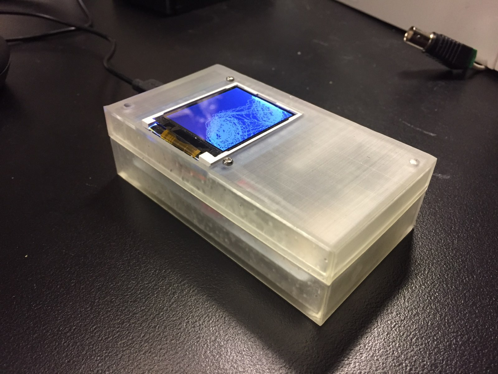
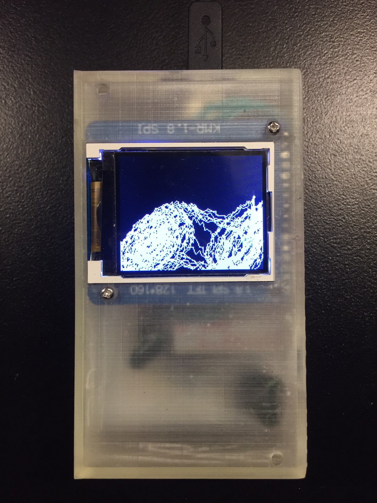

# chaos

A [double scroll attractor](https://en.wikipedia.org/wiki/Multiscroll_attractor) plotter implemented via [Chua's circuit](https://en.wikipedia.org/wiki/Chua%27s_circuit).

Thanks to [chuascircuits.com](http://www.chuacircuits.com/howtobuild1.php).

